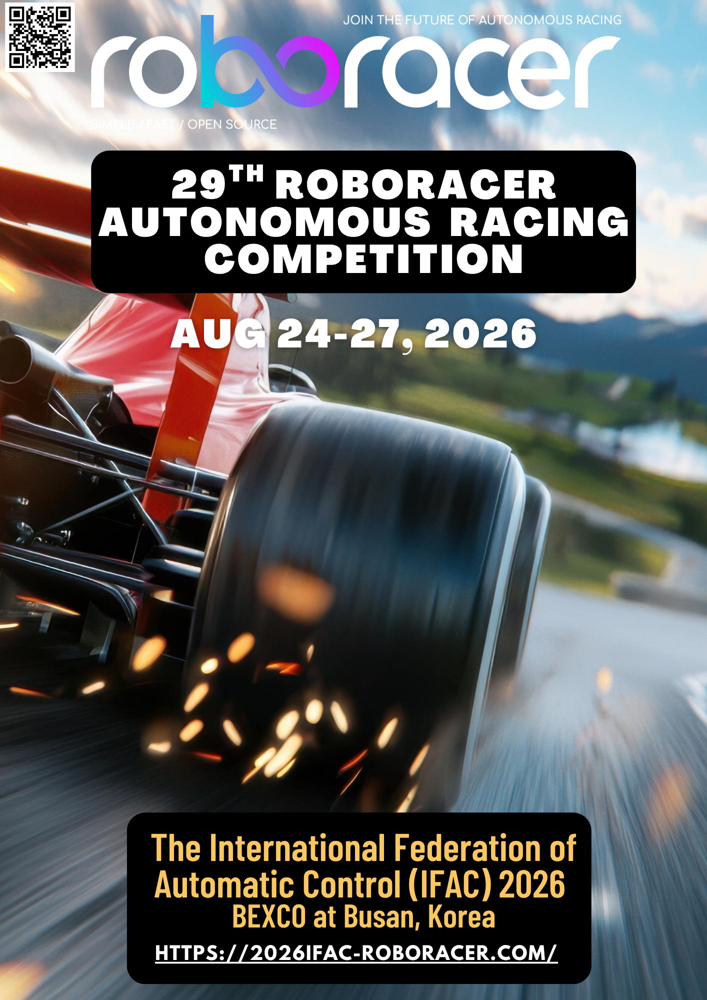

1

Conference Registration

Register for IFAC 2026. See the <a href="#registration-fee">fee table</a> for registration costs.

<a href="https://www.ifac2026.org/fairContents.do?FAIRMENU_IDX=21697&hl=ENG" class="button small">Register for IFAC</a>

2

Submit Google Form

Enroll your team information. We manage the competition based on this.

<a href="https://forms.gle/RvSRwHdDqSfyQyvF6" class="button small">Submit Form</a>

3

Confirm Registration

Check the participant list below to verify your team is registered.

<a href="#participants" class="button small">View Participants</a>

If you completed steps 1 & 2 but your team is not listed, please contact <a href="mailto:ryujs@unist.ac.kr">ryujs@unist.ac.kr</a>.

 
- Both IFAC registration and Google Form submission are required.
- IFAC competition registration costs €100 per person. You may also register with other options besides competition-only to participate.
- Every team member must individually register for IFAC — not just the team leader.
- If you have already registered for IFAC under any category, you do not need to add the competition option separately.
- After completing all steps, you must verify that your team appears in the participant list.
- This competition is part of the IFAC conference. Only those who have registered for IFAC in any form are allowed entry. (e.g., supervisors/chaperones without IFAC registration will NOT be granted access)

| On-Line Registration (Feb. 1 - Aug. 9, 2026) | On-Site Registration (Aug. 22 - 28, 2026) |
||:---|:---|
| € 100 | € 140 |

 

	<a href="https://join.slack.com/t/robo-racer/shared_invite/zt-2sfu4qr7p-3oe27mCnH98muwRR9uEAbg" class="button">QnA through slack</a>

 
Click the button above to join the official ROBORACER Slack, then add the **2026ifac-competition** channel.

For more information about the competition, attend the online [orientation]( ) to be held soon.
Also join us through Slack and leave questions if any.

<!-- A form for race observers

If you want to observe without participating in the game, please registration through this link.

	<a href="https://docs.google.com/forms/d/e/1FAIpQLSf5aheoenohT5te_PutaAnLSBmPwK3EKB7EVOtFLEEu3Jk1gQ/viewform?usp=sf_link" class="button">Registration for a observation</a>

 -->

---
<!-- 

	<a href="../participants.html" class="button">Participants</a>

 -->

# Participants

If you have registered for participation but the list below is not updated, please contact us at ryujs@unist.ac.kr.

| TEAM NAME | AFFILIATION | TEAM MEMBERS |
|:---|:---|:---|
|.|.|.|

<!-- Previous Competition Participants (2024)
|AIML|Jeju National University|Junhyeok Yang, Juho Kim, Byeongyeon Kim, Suhwan Kim, Yuncheol Yang, Junhyeok Choi, Jiwook Park|
|DSPlay|Sangmyung University|Jihoon Park, Hyundong Lee, Jungmin Hwang, Woojin Lee|
|KMUTT|King Mongkut's University of Technology Thonburi|Benjamas Panomruttanarug, Phuriphat Chomchuenphrueksa, Peeratchai Chamwong, Rut Huttapong, Pongsakorn Tabtimthai|
|SEA:ME|Kookmin University|Hamin An, Minsung Ko, Jihwan Kim, Juyeon Park, hyeonjin Cha, Jaeheon Kim|
|IDEA_LAB|Gyeongsang National University|Myeongjun Kim, Jihong Park, Juyoung Kim, Sunwoong Moon, Gyuhyeok Lee, Sujin Park|
|MOVE|Inje University|Joonhyung Im, Dongbeen Jeon, Youngrok Kim, Seongwoo Kim, Sehun Park, Jaehyung Choi|
|LiCS-KI|KAIST|Joshua Julian Damanik, Chala Adane Deresa, Minjo Jung, Byeongmin Jeong|
|F1t_lab|Inje University|Seungmin Lee, Hojae Lee, Seonung Jeong, Dongyeop Lee, Seungheon Baek|
|Tayo Eagles|Chungbuk National University|Gihwan Jo, Dohyun Kwon, Geonwoo Kim, Johee Lee, Hyunji Oh|
|Supernova|Inje University|Changryeong Kim, Minseob Seo, Youngwoo Park|
|F1_DDAYA|Inje University|Junho Kim, Woojun Ahn, Minho Lee, Jaeheon Jung|
|GROMIT|Sookmyung Women's University|Yeina Lee, Seongbeen Lee, Jiyoung Kim, Seoyeon Bae|
|KUml KUml|Korea University|Hyebin Jeong, Gyeongjae Kim, Seongdu Yun, Juho Lee, Hojeong Lee, Abirham Yilkal Mogne|
|XNK|Korea University|Woojin Ahn, Jiwon Kim, Hyeongrae Cho, Hyunah Kim, Jongchan Park, Sangryul Baek|
|Breath|Handong Global University|Sunhwan Lee, Sechan Park, Wonbin Lee|
|theSuperJazari|MIMOS Berhad|Mahir Sehmi, Anwar Saamad, Fariz Azmi|
|CIRL|Seoul National University of Science and Technology|Hanif Edma Fauz, Sehyun Jeon, Anak Agung Krisna Ananda Kusuma|
|F1-Mechanic|Inha University|Hyeongmin Lee, Seungmin Oh, Seokho Kim, Myeonggeun Jo, Hyunjae Park|
|Tachyon X|Kyungpook National University|Sangcheol Lee, Jaehwan Lee, Geonjun Park, Hyuntak Lee, Jihoon Jung|
|U-stang|Ulsan National Institute of Science and Technology|Seongjun Lee, Hyeongjoon Yang, Daegeol Ko, Hankyoul Ko|
|SAI|Kangwon National University|Gyeongtae Park, Taehun Yun, Chungi Min|
|MecLAREN|Kangwon National University|Yejin Heo, Woosung Jin, Hyunseo Do|
|Sungborghini|Soongsil University|Inhye Heo, Heeseon Kim, Jonghyuk Song, Jimin Jeon|
|Raptor81|Soongsil University|Nahyun Kwon, Sungmin Park, Chaeun Park, Mingyu Lee|
|FAD|Soongsil University|Suhyun Park, Gyulyn Kim, Hyeokjin Cho, Chaewon Lee|
|ROSS|Soongsil University|Hojae Lee, Jongseung Park, Seojeong Choi|
|SSUNG CAR|Soongsil University|Haechan Jung, Huimin Park, Jaeung Jeong, Bonghoon Hong|
|MR_Lab|Kangwon National University|Seunghyun Song, Raewon Kim, Seongung Kim, Junseok Jeon, Songhyeok Choi, Sangmin Kwon|
|KAU RML|Korea Aerospace University|Jihoon Hong, Jaewoo Seok, Yoojung Son, Minseo Choi|
|Blue Wave|Korea Maritime and Ocean University|Hyunho An, Jihyeon Kim, Minseok Yang|
|확불살라삔다|Dong-a University|Bojeong Park, Seunghwan Kim, Seoyoung Mun, Jaeyeung Jeong, Minho Lee|
|YOLO_JOK|Dong-a University|Donghun Park, Jongwoo Kim, Heecheol Jeong, Youngjun Park, Jungwook Kim|
|Mach 303|Pusan National University|Jinyoung Jo, Minseok Kim, Junhyeok Park, Jiwon Sung, Daehee Lee, Seokyoung Ahn, Eon Joo Lee, Min Seo Kim, Byunghui Kim, Jaehyeon Bae, Haejin Lim, Gahyeon JI |
|라이닷|Handong Global University|Minsu Kim, Minyoung Song, Sieun Park|
|RISE LAB|Sungkyunkwan University|Nabih Pico, JunYoung Han,  Chaeeun Seok, Chaerim Lim, Yeongjun Son, Hansu Shin|
|PNU-1|Pusan National University|Bugeon Kim, Donghyun Koo, Hyunseop Shim|
|머리핑|Dong-a University|Namhyeon Kim, Suil Yoon, Yutaek Jin, Seungwoo Ha|
-->
 
 

