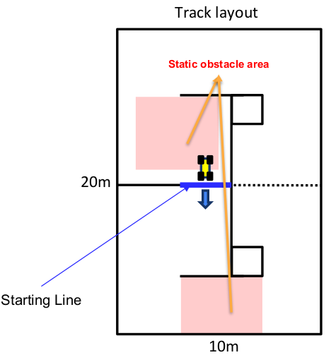

*Date: 2025-09-15*

<!-- *수정일자: 2022-10-15* -->

<!-- 
1. Video submission 
1.1 Video submission exmaple
2. Car inspection - chassis, tires, detection box, foam bumper, motor. battery, main computation unit, lidar, camera, other sensors
3. mapping & practice, mapping, regulated practice, open practice
4. rules 
4.1 Rules for Qualifying and Head-to-head
All computations must be performed onboard!!
No protests regarding Wi-Fi will be accepted.
● Strictly prohibit manual (human) emergency brake
● No data must be transmitted to the vehicle during the race.
Exceptions
  Joystick
    At the start or re-start(for start)
    For emergency stop (ex. After crash, reverse driving, remaining stuck in an obstacle for more than 5
    seconds)
    For entering Pit-stop zone on the Manual Drive Zone for pit-stop
  Remote computer
    When your car is out of track
    When your car is in pit-stop region
    When your car needs re-localization(only for giving initial-guess to your localization algorithm)
Pit-stop
Re-entering
● Any H/W repairment & maintenance inside the track is prohibited (not even pit-stop).

5. Phase 3: Qualification
● Time Trials
● Two goals (two leaderboards):
6. Phase 4: Head-to-head race
● Head-to-head Race
● Random Static Obstacle Areas
Crashing
Penalty cases in Head-to-head race
Warning cases in Head-to-head race

7.Key Point Summary
 -->
 
**Table of content**
- ToC
{:toc}

# 1. General

International ROBORACER Autonomous Racing Competition is a racing competition open to teams of all levels. Competing teams may consist of any number of members; however, each participant should be **a member of only one team**.

This competition will be held as an in-person competition from **August 24th (Monday)** to **August 27th (Thursday)**, **2026**, at **BEXCO** in Busan during **IFAC 2026** (The International Federation of Automatic Control).

ROBORACER Autonomous Racing Competition Schedule: **August 24th (Monday) ~ 27th (Thursday), 2026**

Teams can **register** for the competition through the **official website.** 

<!-- The preferred communication method with the organizers is the ICCAS2024 channel on [ROBORACER GRAND PRIX-teams Slack](https://join.slack.com/t/f1tenthxkorea/shared_invite/zt-1ibqf5yjq-CkG_z1XRhsZgBsCoSy7JiA). -->

# 2. Competition General

1. The competition consists of 5 phases:
   - **Phase 0**: Video submission demonstrating obstacle avoidance capability
   - **Phase 1**: Registration and inspection
   - **Phase 2**: Mapping and practice sessions (mapping, regulated practice, open practice)
   - **Phase 3**: Qualification (time trials)
   - **Phase 4**: Head-to-head race

2. Teams registered to the in-person competition need to provide and build a car by themselves according to the constraints listed below. In addition, each team must have a unique vehicle (i.e., a research lab may not field six teams with one car).

3. To enhance the quality of future ROBORACER Autonomous Racing competitions, winners of each race are encouraged to release their algorithm code under an open-source license in the [ROBORACER Autonomous Racing Community repository](https://github.com/f1tenth) on GitHub.

## 2.0 Video Submission

1. Teams must submit a video demonstrating obstacle avoidance capability before the competition.

2. No specific format is required.

3. The submission must demonstrate the vehicle completing **more than two laps** on the track while **avoiding static or dynamic obstacles**.

4. Please adhere to the deadline.

## 2.1 Inspection

1. The purpose of the Inspection is to check that the hardware of the autonomous cars meets the competition requirements and the cars are not dangerous for the environment, opponents, and people.

2. The car is supposedly built according to instructions, but alternative components may be allowed as long as they comply with the **Rules**. Any unclear or ambiguous points should be checked **in advance** with the race organizers.

3. The team must demonstrate that it is possible to trigger emergency brake through remote human control (**but not for intervening during the race!**).

4. The dedicated time slots for the Mapping and Regulated practice sessions will be designated on a **first-come-first-serve basis**, and only teams that have successfully **completed registration** and **inspection** will be eligible.

5. The inspection of the vehicles is done on the first competition day.

6. The inspection is done by the race referees.

7. The inspection has to be completed before the Time Trials and after significant changes to the cars hardware or algorithms.

- **Vehicle Class** allows only cars that meet the following constraints:

    <!-- 1. The vehicle is constructed according to the official [bill of materials](https://f1tenth.readthedocs.io/en/stable/getting_started/build_car/bom.html). The teams are allowed to use components of similar or lower specifications. -->

    1. Each vehicle will be inspected as a part of qualification whether it meets the criteria. In case the criteria are not met, the vehicle cannot participate.
    2. **The ROBORACER Autonomous Racing Competition emphasizes algorithmic performance. Hardware designed to provide an unfair advantage is strictly prohibited.**.
    3. _Chassis_:
        Any chassis listed as *1:10 scale* car is allowed. Preferably **1:10 Traxxas** (e.g., [TRA74054](https://traxxas.com/products/models/electric/ford-fiesta-st-rally), [TRA6804R](https://traxxas.com/products/models/electric/6804Rslash4x4platinum), [TRA68086](https://traxxas.com/products/models/electric/slash-4x4-tsm)), but generally, any chassis within 15% of the Traxxas cars' dimensions is allowed (238mm ≤ Width ≤ 341mm, 454 mm ≤ Length ≤ 654mm). Both 4WD and 2WD are permitted.
    4. _Tires_:
        **No limitations** (Both sponge and rubber are allowed). However, **chemical additives are strictly prohibited**.
    5. _Motor_:
        **No limitations** on spec. Only single motor can be used in power-train.
    6. _Battery_:
        **4s LiPo Battery** or **lower**. Only one Battery or the combinations of lower-cell cells (Ex: 2s + 2s is allowed).
    7. _Detection Box_:
        The car has to be easily perceivable by the opponent's LiDAR. Therefore, the car must occupy a space of size at least 12×12 cm at every horizontal plane between **10 to 30 cm** above the ground.
    8. _Foam Bumper_:
        The bumper has to be soft to minimize the damage. These two components (Detection Box and Foam Bumper) must be attached if more than one car is on the track.
    9. _Main Computation Unit_:
        **No limitations**.
    10. _LiDAR_:
        Both Hokuyo LiDARs with **0.25° or 0.125°** resolution both are allowed, as well as 30 m range LiDAR. In particular, **3D LiDAR** is also permitted this time (however, please be aware that high-cost 3D LiDAR units may be damaged in high-speed race).
    11. _Camera_:
        Both mono camera (e.g. Logitech C270, Logitech C920, Raspberry Pi Camera Module V2, Arducam) and stereo cameras (e.g. Intel Realsense, ZED) are allowed. Cameras that provide additional information such as **detection or VIO results** from onboard processing in camera are **not allowed**. (Depth information is allowed)
    12. _Other sensors_:
        Other sensors (IMUs, encoders, custom electronic speed controllers) are allowed. Indoor GPS sensors (e.g. Marvelmind) **are not allowed**.

## 2.2 Track & racing environment

The competition will take place at BEXCO in Busan. The characteristics of the environment where the track will be built are:

<!-- 1. The surface is flat and reflective. Therefore, LiDAR beams may reflect from the ground and measure the surrounding area rather than the ground. Similarly, depth cameras have problems with proper ground detection.
2. The room is surrounded by windows and “glass walls”. The windows will be covered by non-transparent material up to 50 cm from the ground to improve the perception. The room is bright, and the Sun can shine into it.
3. The track border is constructed from one air pipes of 33 cm diameters. They are made from aluminium and metal, secured with plastic/wodden holders. Keep in mind that there can be a gap between the pipes through which the LiDAR beams can pass.
4. The track will fit into the area of around the size of 25×10 m.
5. The track can be mapped in either the training sessions on each day or in the qualification session of each team. We are not providing a dedicated time slot for teams to map the track. Since many teams using SLAM algorithm or vision-based localization techniques, a dedicated **Map Creation** or **Mapping** session is not provided for the teams. -->

<!-- 1. The surface is flat and covered with rugs. 
2. The room is a segmented space that uses a gable wall for parts of the auditorium. Since there is no window on the wall, there is no external light coming in, and it is all composed of non-transparent materials.
3. The track border is constructed from one air pipes of 50 cm diameters. They are made from polyester and metal, secured with cable tie and masking tape. Keep in mind that there can be a gap between the pipes through which the LiDAR beams can pass.
4. The track will fit into the area of around the size of 20×10 m.
5. We will allocate a **mapping** time slot for each team approximately for 5 minutes, depending on the scale of the competition. -->

TBA

## 2.3 Mapping & Practice

1. Mapping: About 5 minutes for each team
2. Practice: **Regulated practice** and **Open Practice**
3. We will provide sample obstacles.
4. The dedicated time for Mapping, Regulated practice and Qualification may vary **depending on the number of participating teams**.

## 2.5 Race Rules

### General Rules for Qualification and Head-to-Head Race

1. **All computational processing must be carried out onboard.!!**

2. **No protests regarding Wi-Fi will be accepted.** 
Please ensure that your autonomous system is designed to operate **independently** regardless of Wi-Fi conditions. You may ask teams not participating in the race to turn off their Wi-Fi, but this is purely to facilitate your team's visualization and debugging, not related to algorithm integrity!

3. **Strictly prohibit manual (human) emergency brake**

4. **No data must be transmitted to the vehicle during the race.**

### Joystick Rules
1. Joystick **use** or joystick **pressing** during the race **is not allowed**.
2. Please change the code for autonomous <-> human control switching from **press and hold** method to **on/off** **toggle** method.

3. Joystick Exceptions:
- At the **start** or **re-start** (for start)
- For **emergency stop** (e.g., after crash, reverse driving, remaining stuck in an obstacle for more than 5 seconds)
- For entering **pit-stop zone** on the **manual drive zone for pit-stop**

### Remote Computer Rules
1. Computer (**keyboard and mouse**) use during the race **is** **not allowed**.
2. Monitor can only be used for data plots or visualization through Rviz.
3. **Only one laptop** can be connected for visualization (e.g., RViz) or debugging purposes.

**Remote Computer Exceptions:**
- When your car is **out of track**
- When your car is in **pit-stop region**
- When your car needs re-localization (only for **giving initial-guess** to your localization algorithm)

### Pit-stop Rules

This is a designated zone for adjusting parameters **without removing the vehicle from the track.**
1. When the vehicle is in the **pit-stop zone**, you can use computer (mouse and keyboard) for parameter updates along with malfunction repair or re-localization.
2. Joystick can only be used in the **manual drive zone** to enter the pit-stop zone.
3. **Do not manually drive** with joystick when **restarting** from the pit-stop zone.
4. Manual driving to enter the pit during head-to-head race must **not affect** the opponent vehicle in any way.

### Re-entering Rules
- If the vehicle leaves the track for any reason, the vehicle must be placed back **at the location where it crashed**, although the vehicle's direction can be slightly adjusted.
- This rule also applies when the vehicle stops for unknown reasons.
- This rule applies to both qualification and head-to-head race.
- Taking the vehicle **to arbitrary locations (e.g., starting line)** is strictly **prohibited**.

### Hardware Maintenance Rules
- Any hardware repair and maintenance inside the track is prohibited (not even in pit-stop).
- Examples: repairing broken parts, sensor recalibration, battery replacement, etc., all maintenance activities

## 2.6 Qualification (Time Trial)

### 2.6.1 Definitions

1. **Touching** means moving the object by **less than 5 cm**. Moving by greater distance is called **Crashing**.

2. **Moving the track border** by any distance is called **Crashing**.

<!-- 2. The track will contain several *checkpoints*, marked with a line across the track. Starting line is not a checkpoint. -->

### 2.6.2 General

1. **Time Trials**: The track is same for both practice and race. For **4 minutes** out of the given 6 minutes (This may change depending on total number of teams.)

2. **Static Obstacles**: One obstacle will be placed randomly in each obstacle area. (Each obstacle will be smaller than 0.5m x 0.5m). Position of obstacle will be open on the morning of Qualification day and will be fixed for all teams. **Obstacles will be removed in the middle of the qualifying time.**

3. **Two goals (two leaderboards)**:
   - Fastest **lap time**
   - Highest **number of completed laps** without crashing

4. **Crash Handling**: As long as the vehicle can continue the race without any intervention in the track, we do not check minor 'touch'. Only when the vehicle severely crash the track needing manual (human) intervention, we **invalidate that lap time** and **reset the count of completed laps.**

## 2.7 Head-to-Head Race

### 2.7.1 General

1. The two vehicles start at the different starting lines positioned in opposite directions.

2. In total, two static obstacles are used. One obstacle will be randomly placed in each zone after all teams complete their race preparations. Static obstacles on the track will be removed sometime after the start of the race.

3. Each vehicle must avoid obstacles and the opponent while completing 20 laps within the time limit first.

4. The race will start 10 minutes after the beginning of departure preparation at the latest, regardless of the readiness status of both teams.

**Do not stop the race at your team's discretion without a stop signal from the referee!!**

### 2.7.2 Random Static Obstacle Areas and Crashing

#### Random Static Obstacle Areas
1. **1 obstacle will be randomly placed within the obstacle area for every race before start.**
2. The areas prescribed by red rectangle indicates where static obstacles may be placed.
3. Obstacles will be safely removed after the designated time, ensuring that no vehicles are affected.

#### Crashing
**Track border & Static obstacle**
- Recover the track & obstacle
- If the race can proceed, it should continue without interruption.

**Opponent**
- If a **complete rear-end collision** occurs, a **1-lap addition penalty** will be given to **real vehicle, the offender vehicle**.
- If **side-by-side contact** occurs but no fatal accident (such as a spin or crash) follows, the race continues without interruption.
- The judgment will be made based on the extent of the damage to the victim vehicle.
- In an incident involving two vehicles, if the affected vehicle is still drivable and the offending vehicle **has not overtaken**, the race will continue as **normal**.

**Judgment made for the incident is at the discretion of the on-site referee and must be respected.**

### 2.7.3 Penalty Cases in Head-to-Head Race

● **1-lap addition penalty**
1. A **complete rear-end collision**.
2. A **severe accident with huge impact** even if it is not a complete rear-end collision
3. A fatal accident(spin or crash) caused by any form of **human intervention**
   - Physical interfere
   - Remote signal such as manual brake or drive
4. Accumulations of **3 warnings**

**Only one penalty** will be applied per incident even if that involves **multiple violations**

### 2.7.4 Warning Cases in Head-to-Head Race

1. **Human intervention** on the ego vehicle during the race
2. **Interference** with the opponent vehicle during the race
3. Violation of **remote signal regulations** (joystick, keyboard, mouse)
4. When a **fatal accident** (spin or crash) occurs that does not **correspond to a 1-lap penalty**

**Only one warning** will be applied per incident even if that involves **multiple violations**

#### Example Cases:

### 2.7.5 Evaluation

1. **The first car to complete 20 laps is declared the winner.**
2. **Decisions regarding any incidents are at the sole discretion of the on-site referee and must be respected.**

