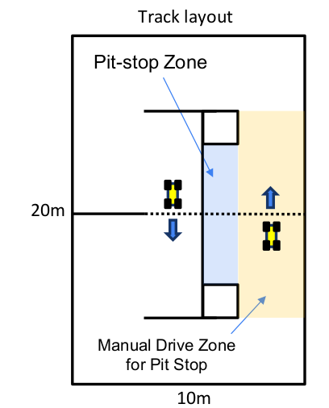
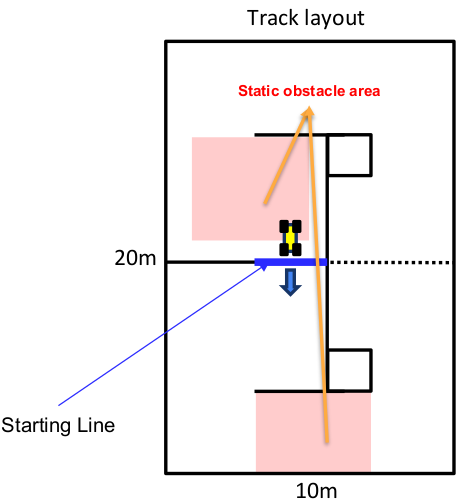
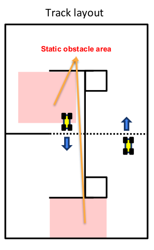
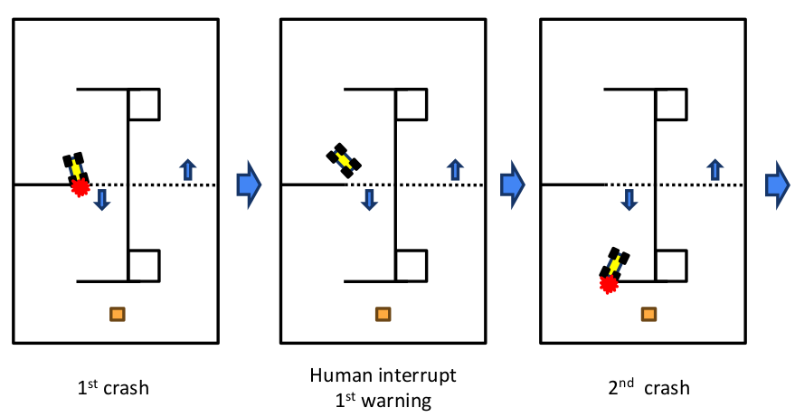
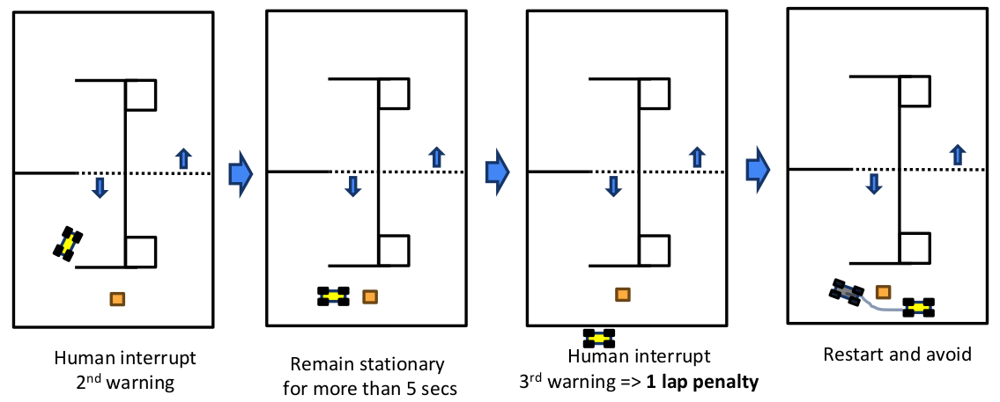

*수정일자: 2025-09-15*
 
**Table of content**
- ToC
{:toc}

# 1. 개요

국제 ROBORACER 자율주행 레이싱 대회는 모든 수준의 팀에게 열려있는 경주 대회입니다. 참가팀은 임의의 수의 구성원으로 이루어질 수 있으나, 각 참가자는 오직 한 팀의 구성원이어야 합니다.

이 대회는 2026년 8월 24일(월)부터 8월 27일(목)까지 부산 BEXCO에서 개최되는 IFAC 2026에서 대면 경쟁으로 진행됩니다.

ROBORACER GRAND PRIX 일정: 2026년 8월 24일(월) ~ 27일(목)

팀은 공식 웹사이트를 통해 대회에 등록할 수 있습니다. 

<!-- The preferred communication method with the organizers is the ICCAS2024 channel on [F1TENTH-teams Slack](https://join.slack.com/t/f1tenthxkorea/shared_invite/zt-1ibqf5yjq-CkG_z1XRhsZgBsCoSy7JiA). -->

# 2. 대회 일반

1. 대회는 5단계로 구성됩니다:
   - **0단계**: 장애물 회피 능력을 보여주는 비디오 제출
   - **1단계**: 등록 및 검사
   - **2단계**: 맵핑 및 연습 세션 (맵핑, 공식 연습, 자유 연습)
   - **3단계**: 예선 (타임 트라이얼)
   - **4단계**: 일대일 경주

2. 대면 경쟁에 등록한 팀들은 아래에 나열된 제약 사항에 따라 직접 차량을 제공하고 제작해야 합니다. 또한, 각 팀은 고유한 차량을 가져야 합니다 (즉, 한 연구실이 하나의 차량으로 여섯 팀을 참가시킬 수 없습니다).

3. 향후 ROBORACER 대회의 품질을 향상시키기 위해, 각 경주의 우승자는 자신의 알고리즘 코드를 Github의 [ROBORACER Autonomous Racing Community repository](https://github.com/f1tenth)에 오픈소스 라이선스로 공개하는 것이 권장됩니다.

## 2.0 비디오 제출

1. 팀들은 대회 전에 장애물 회피 능력을 보여주는 비디오를 제출해야 합니다.

2. 특정 형식은 요구되지 않습니다.

3. 제출물은 **정적 또는 동적 장애물**을 피하면서 트랙에서 **2랩 이상**을 완주하는 차량을 시연해야 합니다.

4. 마감일을 지켜주시기 바랍니다.

## 2.1 차량 클래스

1. **차량 클래스**는 다음 제약 사항을 충족하는 차량만 허용합니다:

    1. 차량은 ROBORACER 지침에 따라 제작되어야 하지만, 규정을 준수하는 한 대체 부품이 허용될 수 있습니다. 불분명하거나 모호한 사항은 경주 주최자와 사전에 확인해야 합니다.
    2. 각 차량은 기준을 충족하는지 예선의 일부로 검사됩니다. 기준을 충족하지 않을 경우, 차량은 참가할 수 없습니다.
    3. **ROBORACER 대회는 알고리즘 경쟁입니다. 유리하게 만들 수 있는 하드웨어는 허용되지 않습니다**.
    4. _섀시_:
        경기는 **1:10 Traxxas** 섀시(예: TRA74054, TRA6804R)로 설계되었습니다. 이러한 섀시가 권장되지만, 일반적으로 Traxxas 차량 치수의 15% 이내인 섀시는 허용됩니다 (238mm ≤ 폭 ≤ 341mm, 454mm ≤ 길이 ≤ 654mm). **4WD와 2WD** 모두 허용됩니다.
    5. _타이어_:
        **제한 없음** (스폰지와 고무 모두 허용). 그러나 **화학 첨가제는 엄격히 금지됩니다**.
    6. _메인 컴퓨팅 유닛_:
        **제한 없음**.
    7. _라이다_:
        **0.25° 또는 0.125°** 해상도의 Hokuyo 라이다와 **30m 범위** 라이다가 허용됩니다. 특히 이번에는 **3D 라이다**도 허용됩니다 (단, 고가의 3D 라이다는 고속 경주에서 손상될 수 있음을 유의하시기 바랍니다).
    8. _카메라_:
        **단일 카메라**(예: Logitech C270, Logitech C920, Raspberry Pi Camera Module V2, Arducam)와 **스테레오 카메라**(예: Intel Realsense, ZED) 모두 허용됩니다. **검출이나 VIO 결과** 등의 추가 정보를 카메라 내부 처리에서 제공하는 카메라는 **허용되지 않습니다**. (깊이 정보는 허용됨)
    9. _모터_:
        사양에 **제한 없음**. 파워트레인에는 **단일 모터**만 사용할 수 있습니다.
    10. _배터리_:
        **4s LiPo 배터리** 또는 그 **이하**. 하나의 배터리 또는 낮은 셀 조합만 허용 (예: 2s + 2s 허용).
    11. _감지 박스_:
        차량은 상대방의 라이다에 의해 쉽게 감지되어야 합니다. 따라서 차량은 지면에서 **10~30cm** 사이의 모든 수평면에서 최소 **12×12cm** 크기의 공간을 차지해야 합니다.
    12. _폼 범퍼_:
        범퍼는 손상을 최소화하기 위해 부드러워야 합니다. 트랙에 두 대 이상의 차량이 있을 경우 이 두 구성 요소(감지 박스 및 폼 범퍼)를 부착해야 합니다.
    13. _기타 센서_:
        기타 센서(IMU, 엔코더, 사용자 정의 전자 속도 컨트롤러)는 허용됩니다. 실내 GPS 센서(예: Marvelmind)는 **허용되지 않습니다**.

## 2.2 트랙 및 경주 환경

대회는 부산 BEXCO에서 열립니다. 트랙이 건설될 환경의 특징은 다음과 같습니다:

TBA

<!-- 1. 표면이 평평하고 러그로 덮여 있습니다. 
2. 방은 강당 일부에 박공 벽을 사용하는 분할된 공간입니다. 벽에 창문이 없어 외부 빛이 들어오지 않으며, 모두 불투명 재료로 구성되어 있습니다.
3. 트랙 경계는 직경 50cm의 에어 파이프로 구성됩니다. 폴리에스터와 금속으로 만들어지며, 케이블 타이와 마스킹 테이프로 고정됩니다. 파이프 사이에 라이다 빔이 통과할 수 있는 틈이 있을 수 있음을 유의하시기 바랍니다.
4. 트랙은 대략 20×10m 크기의 공간에 맞춰집니다.
5. 대회 규모에 따라 각 팀에 약 5분간의 **맵핑** 시간을 할당합니다. -->

## 2.3 맵핑 및 연습

1. **맵핑**: 각 팀에 약 5분

2. **연습**: **공식 연습**과 **자유 연습**

3. 샘플 장애물을 제공합니다.

4. **맵핑**, **공식 연습** 및 **예선**의 전용 시간은 참가팀 수에 따라 달라질 수 있습니다.

5. **맵핑** 및 **공식 연습** 세션의 전용 시간은 **선착순 기준**으로 지정되며, **등록 및 검사를 성공적으로 완료**한 팀만 자격을 갖습니다.

## 2.4 검사

1. 검사의 목적은 자율주행 차량의 하드웨어가 대회 요구사항을 충족하고 환경, 상대방, 사람에게 위험하지 않은지 확인하는 것입니다.

2. 차량은 ROBORACER 지침에 따라 제작되어야 하지만, 규정을 준수하는 한 대체 부품이 허용될 수 있습니다.

3. 팀은 원격 인간 제어를 통해 비상 브레이크를 작동시킬 수 있음을 시연해야 합니다(단, **경주 중 개입용으로는 사용할 수 없습니다**!).

4. 차량 검사는 첫째 날 대회에서 실시됩니다.

5. 검사는 경주 심판이 수행합니다.

6. 검사는 **타임 트라이얼 전**에, 그리고 차량의 하드웨어나 알고리즘에 **중대한 변경 후**에 완료되어야 합니다.

### 2.5 경주 규칙

## 예선 및 일대일 경주 일반 규칙

1. **모든 연산은 차량 내부에서 수행되어야 합니다!!**

2. **Wi-Fi에 관한 이의신청은 받지 않습니다.** 자율주행 시스템이 Wi-Fi 상황과 무관하게 독립적으로 작동하도록 설계되었는지 확인하시기 바랍니다. 경주에 참가하지 않는 팀의 Wi-Fi를 끄라고 요청할 수 있지만, 이는 순전히 팀의 시각화와 디버깅을 용이하게 하기 위한 것이지 알고리즘 무결성과는 무관합니다!

3. **수동(인간) 비상 브레이크 엄격 금지**

4. **경주 중 차량에 데이터를 전송해서는 안 됩니다.**

### 조이스틱 규칙
1. 경주 중 조이스틱 **사용**이나 조이스틱 **누르기**를 **허용하지 않습니다**.
2. 자율주행 <-> 인간 제어 **전환**을 위한 코드를 "**누르고 유지**" 방식에서 "**on/off**" **토글** 방식으로 변경하시기 바랍니다.

**조이스틱 예외:**
- **시작** 또는 **재시작**시(시작용)
- **비상 정지**시 (예: 충돌 후, 후진, 5초 이상 장애물에 갇혀 있을 때)
- **피트스톱 존**으로 진입하기 위한 **피트스톱용 수동 주행 구역**에서

### 원격 컴퓨터 규칙
1. 경주 중 컴퓨터(**키보드 및 마우스**) 사용을 **허용하지 않습니다**.
2. 모니터는 데이터 플롯이나 Rviz를 통한 시각화용으로만 사용할 수 있습니다.
3. 시각화(예: RViz) 또는 디버깅 목적으로 한 대의 랩톱만 연결할 수 있습니다.

**원격 컴퓨터 예외:**
- 차량이 **트랙 밖**에 있을 때
- 차량이 **피트스톱 영역**에 있을 때
- 차량이 재위치 설정이 필요할 때(**위치인식 알고리즘에 초기 추정값을 제공**하는 경우에만)

### 피트스톱 규칙

이는 **차량을 트랙에서 제거하지 않고** 매개변수를 조정하기 위해 지정된 구역입니다.
1. 차량이 **피트스톱 존**에 있으면, 오작동 수리나 재위치 설정과 함께 매개변수 업데이트를 위해 컴퓨터(마우스와 키보드)를 사용할 수 있습니다.
2. 조이스틱은 **수동 주행 구역**에서 피트스톱 존에 진입하기 위해서만 사용할 수 있습니다.
3. 피트스톱 존에서 **재시작**할 때 조이스틱으로 **수동 주행하지 마십시오**.
4. 일대일 경주 중 피트에 진입하기 위한 수동 주행은 상대방 차량에 어떤 식으로도 **영향을 주어서는 안 됩니다**.

### 재진입 규칙
- 차량이 어떤 이유로든 트랙을 벗어난 경우, 차량의 방향은 약간 조정할 수 있지만 **충돌한 위치**에 다시 배치해야 합니다.
- 이 규칙은 차량이 알 수 없는 이유로 멈춘 경우에도 적용됩니다.
- 이 규칙은 예선과 일대일 경주 모두에 적용됩니다.
- 차량을 **임의의 위치(예: 시작선)**로 가져가는 것은 **엄격히 금지**됩니다.

### 하드웨어 정비 규칙
- 트랙 내에서의 모든 하드웨어 수리 및 정비는 금지됩니다(피트스톱에서도 불가).
- 예: 고장난 부품 수리, 센서 재보정, 배터리 교체 등 모든 정비 행위

## 2.6 예선 (타임 트라이얼)

### 2.6.1 정의

1. *접촉*은 물체를 5cm 미만으로 이동시키는 것을 의미합니다. 더 큰 거리로 이동시키는 것을 *충돌*이라고 합니다.

2. 트랙 경계를 어떤 거리로든 이동시키는 것을 *충돌*이라고 합니다.

### 2.6.2 일반

1. **타임 트라이얼**: 연습과 경기 모두 동일한 트랙을 사용합니다. 주어진 6분 중 **4분간** 진행됩니다 (총 참가팀 수에 따라 변경될 수 있음).

2. **정적 장애물**: 각 장애물 영역에 무작위로 하나의 장애물이 배치됩니다. (각 장애물은 0.5m x 0.5m보다 작음). 장애물의 위치는 예선 당일 아침에 공개되며 모든 팀에게 고정됩니다. **장애물은 예선 시간 중간에 제거됩니다.**

3. **두 가지 목표 (두 개의 리더보드)**:
   - 가장 빠른 **랩 타임**
   - 충돌 없이 완주한 **최다 랩 수**

4. **충돌 처리**: 차량이 트랙에서 어떤 개입 없이도 경주를 계속할 수 있는 한, 사소한 '접촉'은 확인하지 않습니다. 차량이 수동(인간) 개입이 필요할 정도로 심하게 트랙을 충돌했을 때만 해당 **랩 타임을 무효화**하고 **완주 랩 수를 재설정**합니다.

## 2.7 일대일 경주

### 2.7.1 일반

1. 두 차량은 반대 방향에 위치한 서로 다른 출발선에서 시작합니다.

2. 총 두 개의 정적 장애물이 사용됩니다. 모든 팀이 경주 준비를 완료한 후 각 구역에 무작위로 하나의 장애물이 배치됩니다. 트랙의 정적 장애물은 경주 시작 후 언젠가 제거됩니다.

3. 각 차량은 시간 제한 내에 장애물과 상대방을 피하면서 20랩을 먼저 완주해야 합니다.

4. 양 팀의 준비 상태와 관계없이 출발 준비 시작 후 늦어도 10분 후에 경주가 시작됩니다.

**심판의 정지 신호 없이 팀 재량으로 경주를 중단하지 마십시오!!**

### 2.7.2 무작위 정적 장애물 구역 및 충돌

#### 무작위 정적 장애물 구역
1. **경주 시작 전 각 경주마다 장애물 구역 내에 1개의 장애물이 무작위로 배치됩니다.**
2. 빨간 사각형으로 표시된 구역이 정적 장애물이 배치될 수 있는 곳을 나타냅니다.
3. 장애물은 지정된 시간 후에 차량에 영향을 주지 않도록 안전하게 제거됩니다.

#### 충돌
**트랙 경계 및 정적 장애물**
- 트랙과 장애물을 복구합니다
- 경주가 계속될 수 있다면 중단 없이 계속해야 합니다.

**상대방**
- **완전한 후방 충돌**이 발생하면 **가해 차량에게 1랩 추가 페널티**가 부여됩니다.
- **측면 접촉**이 발생하지만 치명적 사고(스핀이나 충돌)가 따르지 않으면 경주는 **중단 없이** 
계속됩니다.
- 판정은 피해 차량의 손상 정도에 따라 결정됩니다.
- 두 차량이 연관된 사고 상황에서 피해차량이 주행이 가능하고 가해차량이 추월하지 못한 상황에서는 경기는 그대로 진행합니다.

**사건에 대한 판정은 현장 심판의 재량에 따르며 이를 존중해야 합니다.**

### 2.7.3 일대일 경주 페널티 사례

● **1랩 추가 페널티**
1. **완전한 후방 충돌**.
2. **완전한 후방 충돌이 아니더라도 큰 충격을 동반한 심각한 사고**
3. 모든 형태의 **인간 개입**으로 인한 치명적 사고(스핀 또는 충돌)
   ■ **물리적 간섭**
   ■ **수동 브레이크나 운전** 등의 **원격 신호**
4. **경고 3회** 누적

**여러 위반**이 포함된 사건이라도 사건당 **하나의 페널티**만 적용됩니다

### 2.7.4 일대일 경주 경고 사례

1. 경주 중 자신의 차량에 대한 **인간 개입**
2. 경주 중 상대방 차량에 대한 **방해**
3. **원격 신호** 규정 위반(**조이스틱, 키보드, 마우스**)
4. **1랩 페널티**에 해당하지 않는 치명적 사고(스핀 또는 충돌) 발생시

**여러 위반**이 포함된 사건이라도 사건당 **하나의 경고**만 적용됩니다
#### 예시 사례:

### 2.7.5 평가

1. **20랩을 먼저 완주한 차량이 승리합니다.**
2. **사건에 대한 판정은 현장 심판의 재량에 따르며 이를 존중해야 합니다.**
