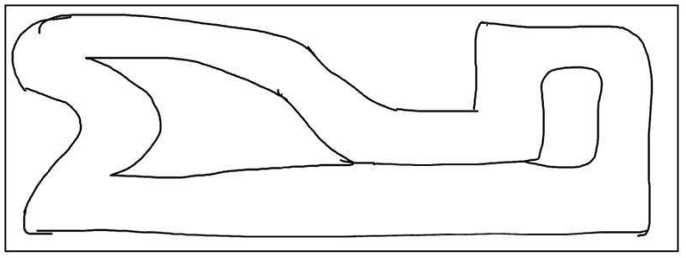
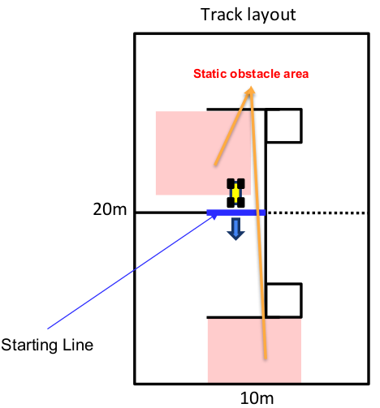
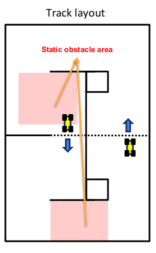
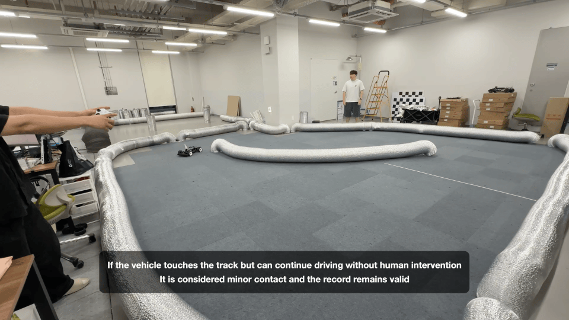
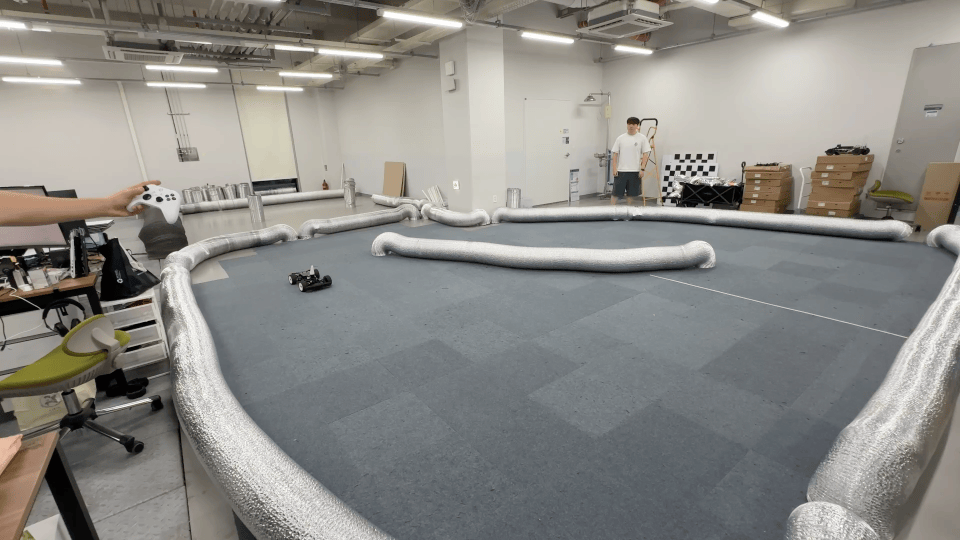
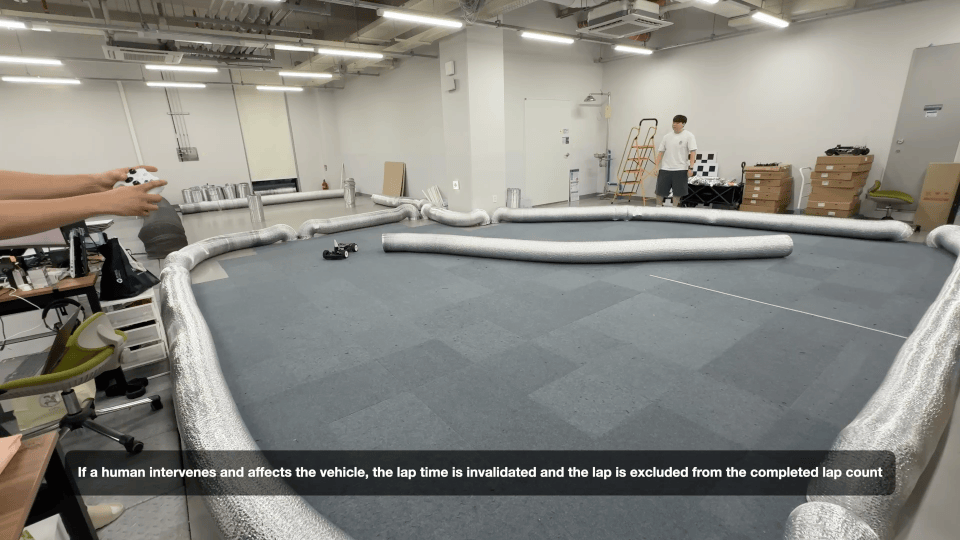
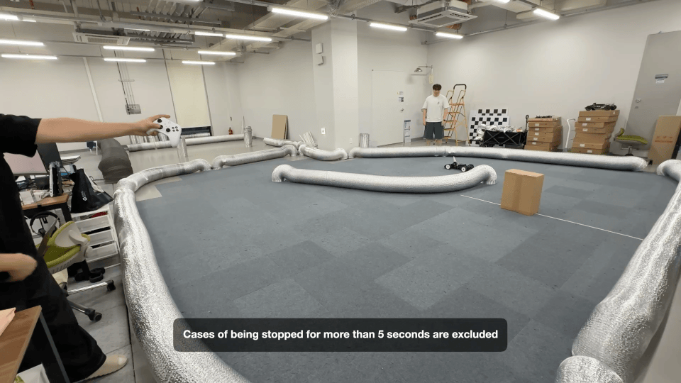

*수정일자: 2026-07-15*

**Table of content**
- ToC
{:toc}

# 1. 개요

국제 ROBORACER 자율주행 레이싱 대회는 모든 수준의 팀에게 열려있는 경주 대회입니다. 참가팀은 임의의 수의 구성원으로 이루어질 수 있으나, 각 참가자는 **오직 한 팀의 구성원**이어야 합니다.

이 대회는 **2026년 8월 24일(월)**부터 **8월 27일(목)**까지 부산 **BEXCO**에서 개최되는 **IFAC 2026**에서 대면 경쟁으로 진행됩니다.

**ROBORACER GRAND PRIX 일정: 2026년 8월 24일(월) ~ 27일(목)**

팀은 **공식 웹사이트**를 통해 대회에 **등록**할 수 있습니다.

## 1.1 대회 일반

1. 대회는 5단계로 구성됩니다:
   - **0단계**: 팀의 자율주행 관련 기술 자료 제출
   - **1단계**: 등록 및 검사
   - **2단계**: 맵핑 및 연습 세션 (맵핑, 공식 연습, 자유 연습)
   - **3단계**: 예선 (미션 수행, 타임 트라이얼)
   - **4단계**: 일대일 경주

2. 대면 경쟁에 등록한 팀들은 아래에 나열된 제약 사항에 따라 직접 차량을 제공하고 제작해야 합니다. 또한, 각 팀은 고유한 차량을 가져야 합니다 (즉, 한 연구실이 하나의 차량으로 여러 팀을 참가시킬 수 없습니다).

3. 향후 ROBORACER 대회의 품질을 향상시키기 위해, 각 경주의 우승자는 자신의 알고리즘 코드를 Github의 [ROBORACER Autonomous Racing Community repository](https://github.com/f1tenth)에 오픈소스 라이선스로 공개하는 것이 권장됩니다.

# 2. 기술 자료 제출

1. 팀들은 대회 전 등록 절차에서 자신의 차에 대한 기술 자료를 제출해야 합니다.
2. 특정 형식은 요구되지 않습니다.
3. 제출물은 팀의 자율주행 차량에 대한 **소프트웨어, 하드웨어 기술**을 요약한 내용을 포함하여야 합니다.
4. 마감일을 지켜주시기 바랍니다.

# 3. 등록 및 검사

## 3.1 차량 클래스

**차량 클래스**는 다음 제약 사항을 충족하는 차량만 허용합니다:

1. 차량은 ROBORACER 지침에 따라 제작되어야 하지만, 규정을 준수하는 한 대체 부품이 허용될 수 있습니다. 불분명하거나 모호한 사항은 경주 주최자와 사전에 확인해야 합니다.

2. 각 차량은 기준을 충족하는지 예선의 일부로 검사됩니다. 기준을 충족하지 않을 경우, 차량은 참가할 수 없습니다.

3. **ROBORACER 대회는 알고리즘 경쟁입니다. 유리하게 만들 수 있는 하드웨어는 허용되지 않습니다**.

4. **섀시**:
   경기는 **1:10 Traxxas** 섀시(예: TRA74054, TRA6804R)를 기준으로 설계되었습니다. 이러한 섀시가 권장되지만, 일반적으로 Traxxas 차량 치수의 15% 이내인 섀시는 허용됩니다 (238mm ≤ 폭 ≤ 341mm, 454mm ≤ 길이 ≤ 654mm). **4WD와 2WD** 모두 허용됩니다.

5. **타이어**:
   **제한 없음** (스폰지와 고무 모두 허용). 그러나 **화학 첨가제는 엄격히 금지됩니다**.

6. **메인 컴퓨팅 유닛**:
   사양에 **제한 없음**. 한개의 컴퓨팅 유닛만 사용 가능합니다.

7. **라이다**:
   사양에 **제한 없음**. 한개의 라이다 센서만 사용 가능합니다. **3D LiDAR**도 허용됩니다.

8. **카메라**:
   **단일 카메라**(예: Logitech C270, Logitech C920, Raspberry Pi Camera Module V2, Arducam)와 **스테레오 카메라**(예: Intel Realsense, ZED) 모두 허용됩니다. **검출이나 VIO 결과** 등의 추가 정보를 카메라 내부 처리에서 제공하는 카메라는 **허용되지 않습니다**. (깊이 정보는 허용됨)

9. **모터**:
   사양에 **제한 없음**. 파워트레인에는 **단일 모터**만 사용할 수 있습니다.

10. **배터리**:
    **4S LiPo 배터리** 또는 **3S 이하**. 배터리 갯수에는 제한이 없으며, 총 셀 수가 4S를 초과하지 않으면 됩니다 (예: 2S + 2S 허용).

11. **감지 박스**:
    차량은 상대방의 라이다에 의해 쉽게 감지되어야 합니다. 따라서 차량은 지면에서 **10~30cm** 사이의 모든 수평면에서 최소 **12×12cm** 크기의 사각형 공간을 차지해야 합니다.
    - 3면만 차지하지는것은 허용되지 않습니다. 4면 모두 막혀있어야 합니다.

12. **폼 범퍼**:
    범퍼는 손상을 최소화하기 위해 부드러워야 합니다. 트랙에 두 대 이상의 차량이 있을 경우 이 두 구성 요소(감지 박스 및 폼 범퍼)를 부착해야 합니다.

13. **기타 센서**:
    기타 센서(IMU, 엔코더, 사용자 정의 전자 속도 컨트롤러)는 허용됩니다. 실내 GPS 센서(예: Marvelmind)는 **허용되지 않습니다**.

## 3.2 트랙 및 경주 환경

대회는 부산 BEXCO에서 열립니다. 트랙이 건설될 환경의 특징은 다음과 같습니다:

트랙이 설치되는 BEXCO 제2전시장 3층 Hall 5A 바닥은 경화 콘크리트(Hardened Concrete) 기반에 우레탄 코팅 마감이 되어 있습니다. 이 표면은 일반적인 아스팔트 포장 대비 마찰 계수가 현저히 낮고 표면이 매끄러운 것이 특징입니다.

트랙 크기는 약 **8 m × 22 m**입니다.

대략적인 맵 형상이며, 조금은 달라질 수 있습니다.

## 3.3 검사

- 검사의 목적은 차량이 대회 요구사항을 충족하고 환경, 상대방, 사람에게 위험하지 않은지 확인하는 것입니다.
- 차량은 ROBORACER 지침에 따라 제작되어야 하지만, 규정을 준수하는 한 대체 부품이 허용될 수 있습니다.
- 차량 검사는 대회 첫째 날 실시됩니다.
- 검사는 경주 심판이 수행합니다.
- 검사는 **연습 전**에 완료되어야 하며, **하드웨어 변경 후에는 재검사**를 받아야 합니다.

### 3.3.1 소프트웨어 검사 (Software Inspection)

- 팀은 **비상 브레이크를 토글(on/off) 방식**으로 작동시킬 수 있음을 시연해야 합니다.
- 토글 방식의 비상 브레이크는 **사람이 충돌을 예측해서 사용하는 것은 금지되어 있습니다.**

### 3.3.2 하드웨어 검사 (Hardware Inspection)

- **섀시 크기 (Chassis Dimension)**: 차량 크기는 3.1절에 명시된 규정을 준수해야 합니다.
- **감지 박스 크기 (Detection Box Dimension)**: 감지 박스는 지면으로부터 **10~30 cm** 높이의 수평면에서 최소 **12 × 12 cm** 공간을 차지해야 합니다.

# 4. 맵핑 및 연습

## 4.1 맵핑

- 맵핑은 **그룹 세션**으로 진행됩니다 — 그룹 내의 모든 팀이 동시에 트랙에서 함께 맵핑합니다.
- **그룹 맵핑 세션 중 알고리즘 테스트는 금지됩니다.**
- 맵파일이 없는 팀은 주변 팀에게 받는 것은 허용 되지만, 이는 운영진과 무관합니다.
- 이번 대회에서는 트랙에 대한 **png, yaml** (for **particle filter** localization) 및 **pbstream** (for **cartographer** localization) 을 제공합니다.

## 4.2 연습

- 각 팀은 여러대의 차량을 준비할 수 있지만 트랙 위에는 팀 당 한대의 차량만 존재해야 합니다.
- 샘플 장애물을 제공합니다.
- 연습 중에 일어난 사고에 대해서 책임을 묻지 않습니다.
- 하지만 사고가 일어난 팀은 심판 요청 시 알고리즘을 설명해야 할 의무가 있습니다.
- 그룹으로 연습이 진행이 되며, 상황에 따라 전체 팀에게 오픈되는 연습시간도 존재할 수 있습니다.

# 5. 예선 (미션 수행, 타임 트라이얼)

<!-- 

 -->

<!--수정 필요-->

## 5.1 일반

- 연습과 예선 모두 동일한 트랙을 사용합니다.
- 예선의 모든 단계는 **8분 내**에 이루어져야 합니다.
  - 총 참가팀 수에 따라 변경될 수 있습니다.
- 예선은 총 **Q1, Q2, Q3**로 이루어진 **3가지의 미션**과 **Fully Autonomous**라는 **1가지의 달성 조건**으로 이루어져 있습니다.
- Q1 부터 Q3는 순차적으로 진행되며, 건너 뛸 수 없습니다.
- Q1, Q2, Q3 사이에는 장애물 설치 및 제거를 위한 **한 바퀴의 buffer lap**이 각각 존재합니다.

## 5.2 예선 1 (Q1)

- 예선 1은 **장애물 없는 트랙(obstacle-free)**에서 **충돌 없이** **3바퀴** 완주하는 것을 목표로 합니다.
- **Q1 진행 중에는 트랙에 장애물이 배치되지 않습니다.**
- 예선 1을 통과하지 못한 차량은 트랙을 충돌없이 몇 바퀴 완주하였는가로 순위가 정해집니다.
- 예선 1을 통과한 차량은 예선 2로 넘어가게 됩니다.

## 5.3 예선 2 (Q2)

- 예선 2는 **랜덤 장애물**에 대해 **충돌 없이** **3바퀴** 완주하는 것을 목표로 합니다.
- 예선 2의 랜덤 장애물은 심판이 배치하며, 총 **2개**가 배치됩니다. 장애물의 위치는 사전에 공지되지 않습니다.
- 예선 2를 통과하지 못한 차량은 트랙을 충돌없이 몇 바퀴 완주하였는가로 순위가 정해집니다.
- 예선 2를 통과한 차량은 예선 3로 넘어가게 됩니다.

## 5.4 예선 3 (Q3)

- 예선 3은 2분 동안 장애물이 없는 트랙에서 **최소 랩타임**을 달성하는 것을 목표로 합니다.
- 2분동안 자유롭게 진행 중 가장 짧은 랩타임을 기준으로 합니다.
- 사람의 개입이 들어가면 랩타임은 무효가 됩니다.

## 5.5 Fully Autonomous (달성 조건)

- 달성 조건은 예선이 진행되는 모든 순간에 적용됩니다.
- 달성 조건은 아래와 같습니다.
  - **예선의 모든 과정이 진행되는 동안 차량에 직간접적 사람의 영향을 끼치지 않은 팀**
  - 5초 이상 정지해 있는 경우는 제외됩니다.
- 달성 조건의 직간접적 영향은 다음과 같습니다.
  - 차량에 손을 대는 행위
  - 조이스틱을 조작하는 행위
  - 키보드/마우스에 손을 대는 행위
  - 컴퓨터를 조작하는 행위
- 완벽한 달성을 위해서 아래와 같은 포즈는 취하면 좋습니다.

## 5.6 정적 장애물

- Q2 과정에서 랜덤하게 배치되는 장애물은 정적 장애물입니다.
- 상세 규정은 [8. 정적 장애물](#8-정적-장애물)을 따릅니다.

## 5.7 기록 무효

- 사람이 개입하여 차량에 영향을 준 경우 **랩 타임을 무효화**하고 **완주 랩 수에서 제외**됩니다.
- 정적 장애물에 접촉이 있는 경우 **랩 타임을 무효화**하고 **완주 랩 수에서 제외**됩니다.
- 트랙에 접촉을 했지만 사람의 개입이 없이 주행이 가능하다면 사소한 접촉으로 간주하고 기록은 유효합니다.

## 5.8 최종 순위 결정

- 예선전의 최종 순위 결정은 다음 기준을 순서로 결정됩니다.
  - Fully Autonomous 만족 여부
  - 통과한 예선의 수
  - 가장 마지막으로 완료한 예선의 기록
- 최종순위 결정의 예시는 다음과 같습니다.
  - 총 12팀이 있다고 가정.
  - Fully Autonomous 만족 팀 3팀, Q3 통과팀(FA 미달성) 3팀, Q2 실패팀(Q1 통과) 3팀, Q1 실패팀 3팀이라고 가정.
  - Fully Autonomous 조건을 만족한 팀 중에서 Q3의 기록 순으로 1위부터 3위까지 배정.
  - Q3를 통과한 팀(Fully Autonomous 미달성) 중에서 Q3 기록 순으로 4위부터 6위까지 배정.
  - Q2를 실패한 팀 중에서 Q2 부분 완주 바퀴 수 순으로 7위부터 9위까지 배정.
  - Q1을 실패한 팀 중에서 Q1 부분 완주 바퀴 수 순으로 10위부터 12위까지 배정.

### 5.8.1 예선 경기 예시

<table>
<thead>
<tr>
<th>순위</th>
<th>Fully Autonomous</th>
<th>Q3(fastest lap)</th>
<th>Q2(완주바퀴)</th>
<th>Q1(완주바퀴)</th>
</tr>
</thead>
<tbody>
<tr><td>1</td><td>O</td><td>10.8 s</td><td>3</td><td>3</td></tr>
<tr><td>2</td><td>O</td><td>11.2 s</td><td>3</td><td>3</td></tr>
<tr><td>3</td><td>O</td><td>13.0 s</td><td>3</td><td>3</td></tr>
<tr><td>4</td><td>X</td><td>9.9 s</td><td>3</td><td>3</td></tr>
<tr><td>5</td><td>X</td><td>10.1 s</td><td>3</td><td>3</td></tr>
<tr><td>6</td><td>X</td><td>12.2 s</td><td>3</td><td>3</td></tr>
<tr><td>7</td><td>X</td><td>-</td><td>2</td><td>3</td></tr>
<tr><td>8</td><td>X</td><td>-</td><td>1</td><td>3</td></tr>
<tr><td>9</td><td>X</td><td>-</td><td>0</td><td>3</td></tr>
<tr><td>10</td><td>X</td><td>-</td><td>-</td><td>2</td></tr>
<tr><td>11</td><td>X</td><td>-</td><td>-</td><td>1</td></tr>
<tr><td>12</td><td>X</td><td>-</td><td>-</td><td>0</td></tr>
</tbody>
</table>

## 5.9 주의 사항

- 그 외 공통 주의사항은 [7. 공통 주의 사항](#7-공통-주의-사항-중요)을 따릅니다.

## 5.10 참고 영상

  <iframe width="896" height="504" style="max-width: 70%;" src="https://www.youtube.com/embed/SlJMuDHodnY" title="YouTube video player" frameborder="0" allow="accelerometer; autoplay; clipboard-write; encrypted-media; gyroscope; picture-in-picture; web-share" allowfullscreen></iframe>

# 6. 일대일 경주

<!-- 

 -->

<!--수정 필요-->

## 6.1 토너먼트 방식

- 일대일 경주는 **더블 엘리미네이션(Double Elimination)** 방식으로 진행됩니다.
- 각 팀은 **두 번 패배** 후 탈락합니다.
- **Day 3 (8월 26일):** Winners Bracket — 이 날은 탈락 팀이 없습니다.
- **Day 4 (8월 27일):** Losers Bracket 경기 시작. Winners Bracket에서 탈락한 팀들이 Losers Bracket에 편입됩니다.
- 최종 우승자는 브래킷을 통해 결정됩니다.
- 참가팀의 수에 따라 일반 tournament 로 진행될 수 있습니다.

## 6.2 일반

- 두 차량은 반대 방향에 위치한 서로 다른 출발선에서 시작합니다.
- 총 3 개의 정적 장애물이 사용됩니다. 모든 팀이 경주 준비를 완료한 후 참가 팀이 각각 한 개의 장애물을 설치하며, 심판이 다른 하나의 장애물을 설치합니다.
- 트랙의 정적 장애물은 경주 시작 선두 차량이 10랩을 완주하였을 때 제거됩니다.
- 각 차량은 시간 제한 내에 장애물과 상대방을 피하면서 20랩을 먼저 완주해야 합니다.

## 6.3 목표

- 먼저 20바퀴를 완주하기.
  - 8강 이전 경기는 10바퀴로 수정이 될 수 있습니다.

## 6.4 무작위 정적 장애물

- 상세 규정은 [8. 정적 장애물](#8-정적-장애물)을 따릅니다.

## 6.5 충돌

- 트랙 경계 및 정적 장애물
  - 경주가 계속될 수 있다면 중단 없이 계속해야 합니다.
- 차량 대 차량
  - **심판의 정지 신호 없이 팀 재량으로 경주를 중단해서는 안 됩니다.**
  - 충돌 상황에서 가해차량이 명확하지만 추월하지 못한 상황에서는 경기는 그대로 진행합니다.
  - 충돌 상황에서 피해차량이 명확하고 피해차량이 주행 불가능하거나 충돌이 심각하거나 추월 당하는 경우 경기는 중단됩니다.

## 6.6 주의 사항

- 감지 박스가 규정을 위반한 차량은 레이스에 참가하지 못합니다.
- 나란히 달리면서 생기는 접촉 및 사고에서는 명확한 가해자가 없으면 레이스를 중지시키지 않습니다.
- 그 외 공통 주의사항은 [7. 공통 주의 사항](#7-공통-주의-사항-중요)을 따릅니다.

# 7. 공통 주의 사항 (중요)

## 7.1 차량 연산·통신·제어

- **모든 연산은 차량 내부에서 수행되어야 합니다.**
- **정상 주행 중 차량에 데이터를 전송해서는 안 됩니다.**
- **정상 주행 중 수동(인간) 비상 브레이크는 엄격히 금지 됩니다**
- 경주 중 조이스틱 **사용**이나 조이스틱 **누르기**를 **허용하지 않습니다**.
  - 자율주행 ↔ 인간 제어 **전환**을 위한 모듈을 "**누르고 유지**" 방식에서 "**on/off**" **토글** 방식으로 변경하시기 바랍니다.
- 시각화(예: RViz) 또는 디버깅 목적으로 한 대의 랩톱만 연결할 수 있습니다.

## 7.2 안전

- 충돌로 인해 주행이 어렵거나 위험한 경우 즉시 차량을 비상정지 시켜야 합니다.
- 사람이 트랙 위에 있는 것은 금지 됩니다.
- 한 차량을 여러 팀에서 공유하는 것은 엄격히 금지 됩니다.
- 트랙 내에 2대 이상의 차가 존재할 수 있는 경우라면 detection 박스는 필수로 부착하여야 합니다. (ex. 예선에서는 부착하지 않아도 됨.)

## 7.3 트랙·장애물 처리

- 앞의 장애물(상대차량 또는 정적장애물)에 너무 가까이 붙어 정지해 있어 회피 기동이 불가능한 경우, 뒤쪽으로 조금 옮길 수 있습니다.
- 본선에서 장애물과의 충돌은 계속 주행할 수 있다면 괜찮습니다. 예선에서 장애물 접촉 시 기록 무효 처리는 [5.7 기록 무효](#57-기록-무효)를 따릅니다.
- 차량이 어떤 이유로든 트랙에 뺐다가 다시 넣는 경우에는, 차량의 방향은 약간 조정할 수 있지만 **나갔던 위치**에 다시 배치해야 합니다.
- 트랙에 접촉이 있다면, 기록이 무효화가 되지 않더라도 **즉시 트랙을 원래의 위치로 돌려놓아야** 합니다.
- 장애물에 접촉이 있다면 즉시 원래의 위치로 돌려놓아야 합니다.

## 7.4 운영

- **Wi-Fi에 관한 이의신청은 받지 않습니다.** 자율주행 시스템이 Wi-Fi 상황과 무관하게 독립적으로 작동하도록 설계되었는지 확인하시기 바랍니다. 경주에 참가하지 않는 팀의 Wi-Fi를 꺼달라고 안내는 하겠지만, 이는 순전히 팀의 시각화와 디버깅을 용이하게 하기 위한 것이지 알고리즘 성능을 위한 것이 아닙니다.
- 트랙 내에서의 모든 하드웨어 수리 및 정비(고장난 부품 수리, 센서 재보정, 배터리 교체 등)는 금지됩니다.
- **맵핑**, **공식 연습** 및 **예선**의 전용 시간은 참가팀 수에 따라 달라질 수 있습니다.
- **맵핑** 및 **공식 연습** 세션의 전용 시간은 **선착순 기준**으로 지정되며, **등록 및 검사를 성공적으로 완료**한 팀만 자격을 갖습니다.

# 8. 정적 장애물

**공통**

- 각 장애물은 0.5m x 0.5m보다 작습니다.
- 장애물의 제거는 차량이 영향 받지 않을 때 안전하게 제거됩니다.
  - 레이스 상황에 따라 조금 늦게 제거될 수 있습니다.
- 장애물은 충돌 이후 바로 복구되어야 합니다.
  - 복구하는 과정에서 상대방에게 영향을 주면 안됩니다.
- 장애물 간의 최소 거리는 1m 입니다.

**예선 전용**

- 랜덤 장애물은 심판이 배치하며, 총 **2개**가 배치됩니다.
- Q2 완료 이후 장애물이 제거 됩니다.
- 장애물의 위치는 사전에 공지되지 않습니다.

**본선 전용**

- 참가 팀, 심판이 각각 한 개, 총 3개의 정적 장애물을 배치합니다.
- 절반의 레이스를 완료한 차량이 생길 시 장애물이 제거됩니다.
- 장애물의 위치는 두 차량이 출발선에서 모두 준비를 마친 후 놓여집니다.
  - 장애물이 놓여진 후 코드를 수정하거나 경로를 바꾸는 것은 금지 됩니다.
  - 장애물이 놓여진 후 출발 신호 만이 차량에 전달이 될 수 있습니다.
- 출발 위치 기준 1m 내에는 놓일 수 없습니다.

# 9. 페널티

**사건에 대한 판정은 현장 심판의 재량에 따르며 이를 존중해야 합니다.**

**여러 위반**이 포함된 사건이라도 사건당 **하나의 페널티**만 적용됩니다.

<table>
<thead>
<tr><th>위반 사항</th><th>예선</th><th>본선</th></tr>
</thead>
<tbody>
<tr><td>장애물 위치에 따른 사람의 경로 수정 및 선택</td><td>한순위 강등</td><td>1랩 페널티</td></tr>
<tr><td>레이스 중 파라미터 튜닝 또는 경로 수정 및 계획</td><td>한순위 강등</td><td>1랩 페널티</td></tr>
<tr><td>조이스틱, 키보드, 마우스 사용 [a]</td><td>한순위 강등</td><td>경고</td></tr>
<tr><td>충돌로 망가진 트랙을 적극적으로 수정하지 않는 경우 [c]</td><td>한순위 강등</td><td>경고</td></tr>
<tr><td>부정출발</td><td>-</td><td>경고</td></tr>
<tr><td>감지 박스의 고정이 제대로 되지 않는 경우 [d]</td><td>-</td><td>경고</td></tr>
<tr><td>상대방 차량에 대한 간접적 방해 [e]</td><td>-</td><td>경고</td></tr>
<tr><td>경미한 후방 충돌</td><td>-</td><td>경고</td></tr>
<tr><td>상대방 차량에 대한 직접적 방해 [b]</td><td>-</td><td>1랩 페널티</td></tr>
<tr><td>큰 충격을 주는 사고를 유발한 경우</td><td>-</td><td>1랩 페널티</td></tr>
<tr><td>경고 3회 누적</td><td>-</td><td>1랩 페널티</td></tr>
<tr><td>페널티 랩이 누적되어 총 3바퀴가 추가된 경우</td><td>-</td><td>실격</td></tr>
</tbody>
</table>

**세부 사항**

1. **조이스틱, 키보드, 마우스 사용**: 예외 허용 사례:
   - 차량이 트랙위에서 빠진 경우
   - re-localization을 위한 initial guess 를 전송하는 경우
   - 심판이 레이스 중지를 선언하여 비상 정지가 필요한 경우
   - 출발, 재출발에서 출발신호를 전달하는 경우
   - 충돌로 인한 주행 불가 상태인 경우 비상정지가 필요한 경우
   - 장애물에 5초이상 갇혀서 비상정지가 필요한 경우
   - 이상 주행(ex. 역주행)을 막기 위한 비상정지가 필요한 경우
   - 레이스 종료 이후 정지하는 경우
2. **상대방 차량에 대한 직접적 방해**: 트랙을 고치러 가다가 상대방 차량에 물리적인 접촉으로 주행에 영향을 주는 경우
3. **충돌로 망가진 트랙 미수정**: 매 바퀴마다 제대로 수정하지 않을 시 새로운 경고 부여 가능
4. **감지 박스 고정 불량**: 매 바퀴마다 제대로 수정하지 않을 시 새로운 경고 부여 가능
5. **상대방 차량에 대한 간접적 방해**: 트랙을 고치러 가다가 상대방 차량의 detection 모듈에 감지되어서 주행에 영향을 주는 경우.

## 9.1 예시 사례

<table>
<tbody>
<tr><td style="vertical-align: top;"></td><td style="vertical-align: top;"><strong>Case 1</strong>: 트랙과 충돌은 있지만, 자율주행모드로 지속가능한 경우 예선과 본선 모두 페널티가 없습니다. 다만 충돌 이후에는 트랙을 즉시 수정해야 합니다.</td></tr>
<tr><td style="vertical-align: top;"></td><td style="vertical-align: top;"><strong>Case 2</strong>: 트랙과 충돌로 인해 주행이 지속 불가능한 경우 예선에서는 랩 타임이 무효화됩니다. 본선에서는 페널티가 없습니다. 트랙을 수정할 때는 상대방 차량에 영향을 주지 않는 것이 중요합니다. 트랙 수정이 다소 늦어지더라도, 상대방이 영향받지 않는 시점에 수정해야 합니다.</td></tr>
<tr><td style="vertical-align: top;"></td><td style="vertical-align: top;"><strong>Case 3</strong>: 충돌이후 조이스틱으로 매뉴얼 조작 후 경기를 진행하는 경우 예선에서는 랩 타임 무효화뿐만 아니라 한순위 강등이 됩니다. 본선에서는 경고 1회가 부여됩니다.</td></tr>
<tr><td style="vertical-align: top;"></td><td style="vertical-align: top;"><strong>Case 4</strong>: 장애물과의 접촉 및 충돌이 생긴 경우 접촉의 강도와 상관없이 경미한 접촉이더라도, 예선에서는 랩 타임이 무효화됩니다. 본선에서는 페널티가 없습니다.</td></tr>
<tr><td style="vertical-align: top;"></td><td style="vertical-align: top;"><strong>Case 5</strong>: 장애물 앞에서 진행하지 못하고 5초이상 정지하는 경우 예선에서는 Fully Autonomous를 달성할 수 없습니다. 본선에서는 페널티가 없으며, 차량을 트랙에서 빼서 파라미터를 수정할 수 있습니다.</td></tr>
</tbody>
</table>
